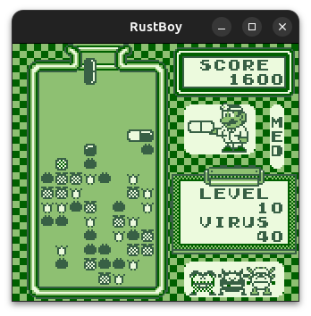
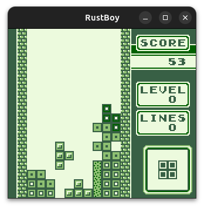

# RustBoy

RustBoy is a Game Boy emulator written in Rust that can also be run in
the browser. It emulates the
original Game Boy as introduced in 1989.
It is a work in progress and is not yet fully functional. However,
[some ROMs can already be run without and problems](#roms-that-work).

Emulation in this case describes the process of simulating the
hardware and software of a device, in this case the Game Boy. This
project is not about emulating the Game Boy as accurately as possible.
Instead, a goal was, to structure the code in a way which is
straightforward to understand and that may offer a good starting point
for someone who wants to learn about (Game Boy) emulation.

Since this is my first emulation project, I used a lot of resources
and tutorials to get started. As these might also be useful to others,
I have listed some of them
in [Resources and Tutorials Used](#resources-and-tutorials-used).
I want to highlight
the [DMG-01](https://rylev.github.io/DMG-01/public/book/introduction.html)
tutorial, which explains how to start writing a Game Boy emulator in
Rust. A lot of parts are still missing, but this project can be seen
as a continuation of that tutorial/implementation of what is still
missing in that tutorial.

## Screenshots




## Features

- Emulation of the Game Boy
- Passes all
  of [Blarggs](https://github.com/retrio/gb-test-roms/tree/master/cpu_instrs)
  CPU instrs test roms
- Implementation of all instructions except for [
  `STOP`](https://rgbds.gbdev.io/docs/v0.9.1/gbz80.7#STOP)
- Each scanline is rendered individually (to a buffer texture)
- Scalable window
- Runs in the browser
  using [WASM](https://webassembly.org/)

## Implementation details

The emulator is implemented in Rust and tries to stay as close to the
original hardware setup as possible. That is, there are three main
components (structs) that make up the RustBoy (struct). These are:

- CPU: responsible for executing the instructions and
  contains methods for doing so
- PPU: responsible for
  handling the rendering of the graphics
- MemoryBus: responsible for handling the memory access

The memory is stored in one single array like in the original
hardware.
This array is stored in the MemoryBus struct, which is then passed as
a (mutable) reference to the different methods in case they need
to read/write from/to memory.

Rendering to the PC/Browser is done
using [wgpu](https://github.com/gfx-rs/wgpu) for the GPU interactions
and [winit](https://github.com/rust-windowing/winit) for window
handling. We render each scanline individually to a texture which
stores the pixel data until a full frame is rendered. This texture
is then rendered to the screen.

## ROMs that work

The following is a list of ROMs that have been tested and
work without any problems:

- Dr. Mario
- Tetris
- TicTacToe

## Resources and Tutorials Used

As stated in the [introduction](#RustBoy), the starting point for this
project was
the [DMG-01: How to Emulate a Game Boy](https://rylev.github.io/DMG-01/public/book/introduction.html)
tutorial
for writing a Game Boy emulator in Rust. Since that tutorial however,
is not very complete, I had to look for other resources to fill in the
gaps.

The main resource always mentioned in the context of Game Boy
emulation is the [Pan Docs](https://gbdev.io/pandocs/). It is
considered the "single most comprehensive technical reference to Game
Boy available to the public". This reference includes information on
all parts of the Game Boy. However, since it is a technical
reference, it is not very beginner friendly. Instead I would recommend
the above
linked [DMG-01](https://rylev.github.io/DMG-01/public/book/introduction.html),
the [Game Boy Emulation in JavaScript](https://imrannazar.com/series/gameboy-emulation-in-javascript)
tutorial
or [this tutorial for an emulator written in C](http://www.codeslinger.co.uk/pages/projects/gameboy/beginning.html).

Pan Docs also misses another aspect, which is the specifications of
the different opcodes. For this, I used two different resources.
As the main reference, I used
the [RGBDS: gbz80(7) - CPU opcode reference](https://rgbds.gbdev.io/docs/v0.9.0/gbz80.7).
However, the
[Interactive GB Opcode Table](https://meganesu.github.io/generate-gb-opcodes/)
visualizes the different opcodes
in a much better way and also has brief explanations of what they do.

For the actual rendering to the computer screen/browser and learning
wgpu and winit, I used
the [Learn Wgpu](https://sotrh.github.io/learn-wgpu/) which gives a
good
introduction into wgpu and the basics of rendering/shaders (in Rust).

At last, for debugging (the CPU) I used the
great [Game Boy Doctor](https://github.com/robert/gameboy-doctor)
which
is a tool that allows to compare logs with working emulators for
[Blarggs](https://github.com/retrio/gb-test-roms/tree/master/cpu_instrs)
CPU instr test roms.
I also used
the [Binjgb - A Game Boy emulator implemented in C with good trace
logging for comparing logs instruction by instruction](https://github.com/binji/binjgb)
Game Boy
emulator to compare my logs with its logs. For this, I wrote a small
python script [check_logs.py](check_logs.py).

To debug the PPU and the rendering however, I used
the [dmg-acid2 test rom](https://github.com/mattcurrie/dmg-acid2?tab=readme-ov-file#failure-examples).

## How to run the emulator

Although no special prerequisites should be needed, please check
[wgpu](https://github.com/gfx-rs/wgpu), [winit](https://github.com/rust-windowing/winit)
and the [learn wgpu](https://sotrh.github.io/learn-wgpu/#what-is-wgpu)
for more information on possible issues with some platforms.

Running the emulator is as easy as running the following command:

```
cargo run --release -- --ROM "roms/[ROM_NAME].gb"
```

Note that `[ROM_NAME]` should be replaced with the name of the ROM you
want to run. Some test roms are included in the `roms` folder.

One can also run the emulator in development mode by removing the
`--release` flag. This will, however, slow down the emulator
significantly.

## Missing features

- Being able to load a boot ROM
- Sound emulation
- [MBCs](https://gbdev.io/pandocs/MBCs.html)